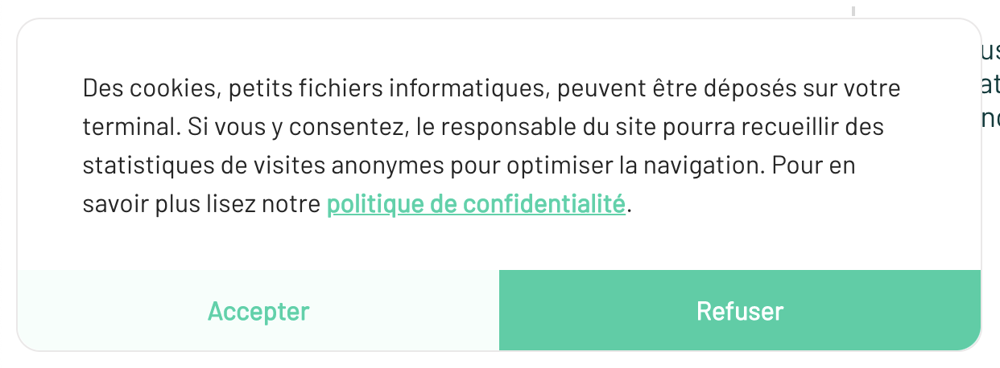
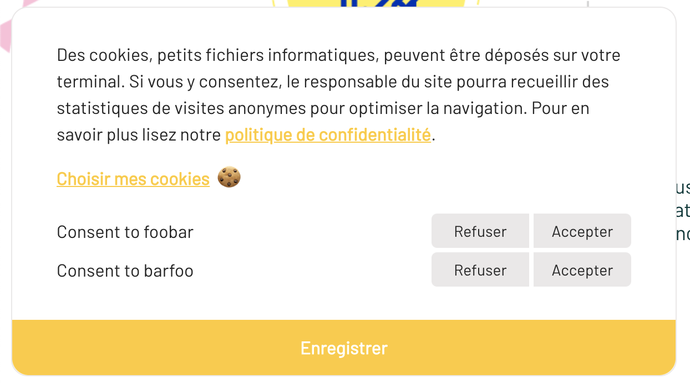

# Consent Bundle

This bundle provides a "cookies toast" allowing you to require user consent before using tracking scripts or cookies.






## Installation

```
composer require elao/consent-bundle
```

In your `bundles.php` files:

```diff
return [
+    Elao\Bundle\ConsentBundle\ElaoConsentBundle::class => ['all' => true],
];
```

## Configuration

By default, the bundle provide a single consent type called `default`.

You can replace this default consent by one or multiple custom consent:

```yaml
elao_consent:
    consents:
        foobar:
            label: Consent to foobar
        barfoo:
            label: Consent to barfoo
```

You can also configure the cookie containing user consent:

```yaml
elao_consents:
    cookie:
        name: "consent"
        ttl: 15552000 # 6 months
```

## Usage

In Twig with default consents:

```twig

    <script>
        // your script requiring consent here
    </script>

```

With multiple consents:

```twig

    <script>
        // your script requiring consent here
    </script>


    <script>
        // your script requiring consent here
    </script>

```

## Overrinding colors

In your CSS:

```css
.elao-consent {
    --elao-consent-primary: #007bff;
    --elao-consent-primary-dark: #256cdf;
    --elao-consent-secondary: #dfebfa;
    --elao-consent-secondary-dark: #cadef8;
    --elao-consent-danger: #ef4055;
    --elao-consent-neutral: #eae8e8;
    --elao-consent-light: #fff;
    --elao-consent-dark: #252525;
}
```

SASS example:

```scss
.elao-consent {
    $elao-consent-base-color: #FFCA29;
  
    --elao-consent-primary: #{$elao-consent-base-color};
    --elao-consent-primary-dark: #{darken($elao-consent-base-color, 1%)};
    --elao-consent-secondary: #{lighten($elao-consent-base-color, 50%)};
    --elao-consent-secondary-dark: #{darken(lighten($elao-consent-base-color, 50%), 1%)};
}
```
